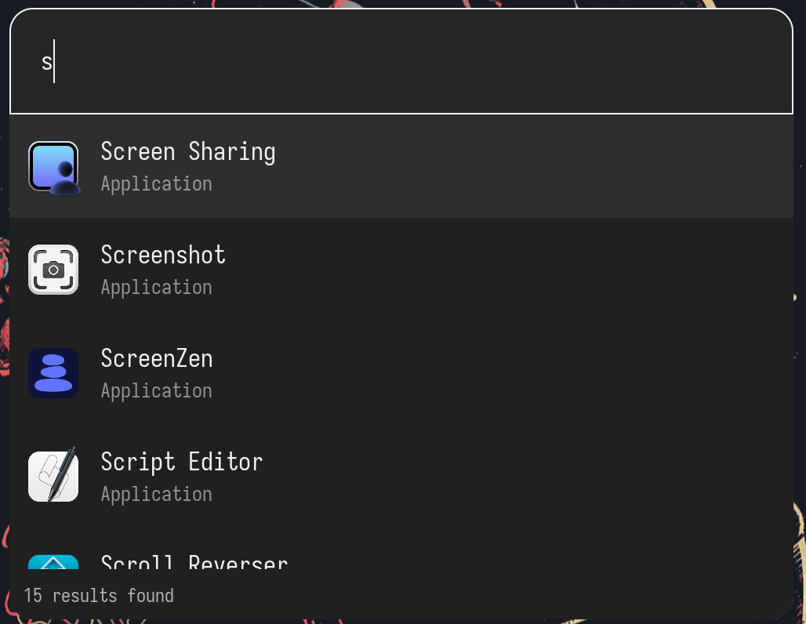

<!-- Header -->
<p align="center">
  
</p>

<h1 align="center">rustcast-cross</h1>

<p align="center">
    A fork of <a href="https://github.com/umangsurana/rustcast">rustcast</a> with active cross platform development
</p>

<p align="center">
  <a href="https://github.com/rustcast-cross/rustcast-cross/stargazers">
    
  </a>
  <a href="https://github.com/unsecretised/rustcast/blob/main/LICENSE">
    
  </a>
</p>

RustCast, Raycast and PowerToys Run are productivity tools. They provide a popup
search bar that people can use to do many things, like opening apps,
calculators, quick-notes, etc.

**Community:** https://discord.gg/bDfNYPbnC5

## Why does this fork exist?

The main repo recently stopped having official support for platforms other than MacOS. This fork is
meant to have that.

It'll probably be less polished than the main repo, at least in the short term, and they probably
*won't* have perfect feature parity by any means, since that's just not all that important.




## Supported platforms

- **Windows**
- **MacOS** \*
- **Linux** \*

\* Probably rather wonky

## Installation

### Homebrew

```
brew tap unsecretised/tap
brew install --cask rustcast
```

Then launch it via launchpad or spotlight (hopefully the last time you have to
use spotlight :) Have fun!)

### Via github releases

1. Go to the
   [releases page](https://github.com/unsecretised/rustcast/releases/latest)
1. Download the `.zip` file or `.dmg` file
1. If `.dmg` file, open it and drag the `RustCast.app` to your `/Applications/`
   (you should be guided)
1. If `.zip` file, extract the `RustCast.app` to your `/Applications/`

### Building it youself

#### MacOS

1. Clone the repo with `git clone https://github.com/rustcast-cross/rustcast-cross/rustcast.git`
1. Install `cargo bundle` with `cargo install cargo-bundle` (Requires cargo to
   be installed)
1. Run `cargo bundle --release` to build RustCast for your system (The App Dir
   will be available at: `target/release/bundle/osx/RustCast.app`)
1. Move the `RustCast.app` directory to your `/Applications/` folder, and launch
   RustCast

#### Windows and Linux

1. Clone the repo with `git clone https://github.com/rustcast-cross/rustcast-cross/rustcast.git`
1. Run `cargo build --release` to build rustcast for your own device

## Config

> [!NOTE]
> Taken verbatim from the upstream repo

> I have a high chance of forgetting to update the config docs, but even if I
> do, you will most likely be able to find my config and a list of the latest
> config options easily
> [here](https://github.com/unsecretised/rustcast-dotfiles)

The config file should be located at: `~/.config/rustcast/config.toml` RustCast
creates the default configuration for you, but it does use its
[default options](docs/default.toml) Here's a full list of what all you can
configure [The list](docs/config.toml) The blurring is still a bit wonky, and
will be fixed in the upcoming releases

## Feature list

### Finished

- [x] Autoload installed apps 11/11/2025
- [x] Search through apps 11/11/2025
- [x] Generate [randomvar](https://github.com/Nazeofel) (between 0 and 100) via
      the app. Simply type `randomvar` and it will generate the num for you
- [x] Image icons next to the text 13/12/2025
- [x] Scrollable options 12/12/2025
- [x] Customisable themes (13/12/2025)
  - [x] Configurable colours
- [x] Spotify control - Ability to control spotify via the app
- [x] Allow variables to be passed into custom shell scripts.
- [x] Google your query. Simply type your query, and then put a `?` at the end,
      and press enter
- [x] Calculator (27/12/2025)
- [x] Clipboard History (29/12/2025) This works by typing `cbhist` to enter the
      cliboard history page, which allows u to access your clipboard history,
- [x] Blur / transparent background (7/1/2026) and then use `main` to switch
      back, or just open an close the app again
- [x] Select the options using arrow keys
- [x] Tray icons (8/1/2026)
- [x] Unit Conversions (19/1/2026) thanks to [Hriztam](https://github.com/hriztam)
- [x] Emoji Searching (19/1/2026) Allows people to search for emojis through rustcast

### Planned:

- [ ] Popup note-taking
- [ ] Plugin Support (Partially implemented on 15/12/2025)
- [ ] Hyperkey - Map CMD + OPT + CTRL + SHIFT to a physical key
- [ ] Ability to pick between tabs in firefox / chromium browsers - using
      [Puppeteer](https://pptr.dev/)

## RustCast wouldn't be possible without these people:

> [!NOTE]
> Taken verbatim from the upstream repo

- [Nazeofel](https://github.com/Nazeofel) - First sponsor + initiater of windows
  support
- [Mnem42](https://github.com/mnem42) - Helped add windows support
- [Random Scientist](https://github.com/Random-Scientist) - First ever community
  contributor to rustcast
- [Lemon](https://github.com/lemonlambda) - Sponsored me, and gave me free
  Discord Nitro
- [Julie / Zoey](https://github.com/zoey-on-github) - Gave me amazing feedback
  and has been using RustCast since almost the first version!

All the people who starred my repo!!

Those who sponsor me also get a free easter egg inside RustCast, so if you want
a free easter egg, a dollar is all you need!

### Contributors

<a href="https://github.com/rustcast-cross/rustcast-cross/graphs/contributors">
  
</a>

### Easter egg list:

- Nazeofel (Random Variable on discord) -> led to the _randomvar_ easter egg
- Lemon -> led to the _lemon_ easter egg that shows "lemon" on rustcast
