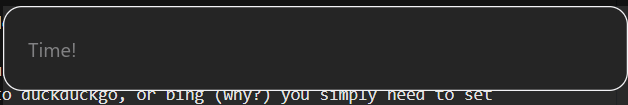

# Configuring rustcast

Rustcast is designed to be reasonably configurable in general. Because of this, there's a config
file you can edit to change how it does things™.

If rustcast can't find the config file at

- `~/.config/rustcast/config.toml` on linux/macos
- `%LOCALAPPDATA%/rustcast/config.toml` on windows

it creates a new one at the location, with the data in [the default config](default.md)

## "Root" configs

```toml
{{#include ../assets/default.toml::9}}
```

- `toggle_hotkey`, `clipboard_hotkey`  
  These hide and show the rustcast window, just opening to different pages. `toggle_hotkey` opens
  to the main search page, clipboard hotkey opens to the clipboard history page.

  You **MUST** Provide a Key, but a modifier is optional. The "letter" keys are in the format
  `Key<LETTER>` where the letter is always captials, e.g. `KeyG`, `KeyR`

  Some of the common valid modifiers (and the respective MacOS Key it maps to):
  - `SUPER` (Command)
  - `ALT`   (Option)
  - `CTRL`  (Control) 
  - `SHIFT` (Shift)

  > see the full list [here](https://w3c.github.io/uievents-key/#keys-modifier)

  `+`s are used as separators between them, e.g. `CTRL+SHIFT+KeyA`, which is parsed as the
  modifiers `CTRL` and `SHIFT`, with the key `A`.
  
  There are too many keys to list exhaustively, the full list is in the enum definition 
  [here](https://docs.rs/global-hotkey/0.7.0/global_hotkey/hotkey/enum.Code.html)

- `placeholder`  
  This is a string that contains the search input placeholder text, e.g.
  
  

  (yeah, I was feeling a bit goofy when setting this)

- `search_url`  
  This is the search engines URL thats used when doing web searches (using the `?` suffix)
  
  A simple way to think about this is that for your search engine of choice, you have to put: %s 
  where the query will go. If you want to switch to duckduckgo, or bing (why?) you simply need to 
  set it to `https://duckduckgo.com/search?q=%s` or `https://bing.com/search?q=%s` respectively. 
  For google, you can refer to the default config, and rustcast also uses google by default.
  
  Google was chosen as the default because it's the most popular one.

- `haptic_feedback `
  > [!NOTE]
  >
  > All secretised's words, I don't actually understand what this does myself

  A random feature I added, you can have the macos haptic feedback be triggered when you type in rustcast. I added this for fun, but if you want to add this you can. This is a boolean value (AKA `true` or `false`), where `true` means it will enable haptic feedback.

- `show_trayicon`
  This is if you don't want the menubar icon, you can choose to disable the RustCast menu bar icon.

- `shells`
  See [the associated file on the format](shells.md)

- `index_dirs`
  > [!NOTE]
  >
  > Only really known to work on windows

  The dirs to index. This can be in the format `<path>` or the format `<path>:<maximum depth>`. If
  the maximum depth is set, doesn't index any files deeper than that depth.

- `index_exclude_dirs` and `index_include_dirs`

  `index_exclude_dirs` is a list of any directories to *exclude* from the search.
  `index_include_dirs` is a list of directories to index anyway, ignoring `index_exclude_dirs`.

## Buffer rules
```toml
[buffer_rules]
clear_on_hide = true
clear_on_enter = true
```

`clear_on_hide` and `clear_on_enter` mean whether the "buffer" (aka the text box's content),
should be cleared when the app is hidden / entered